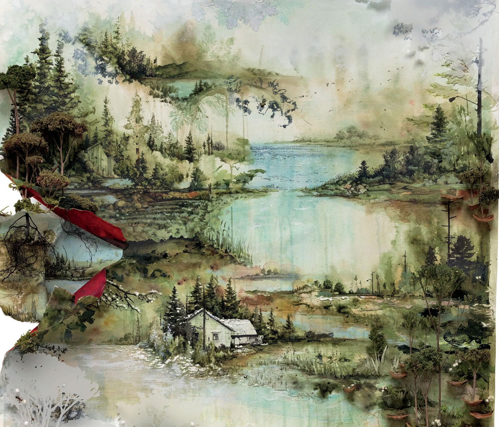
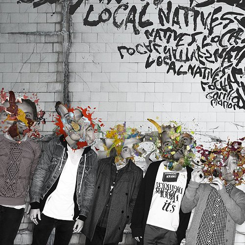
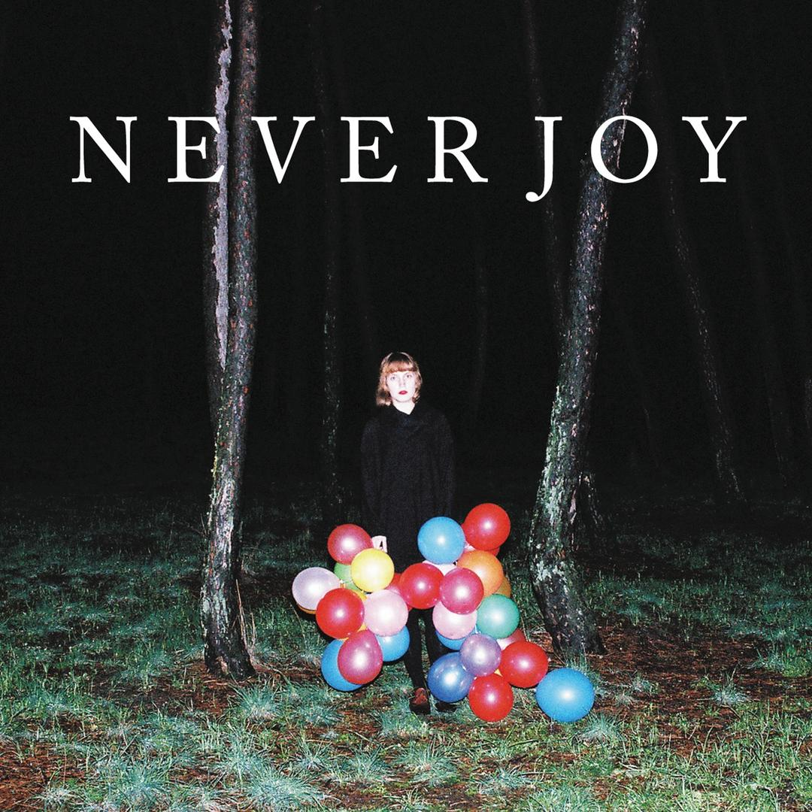
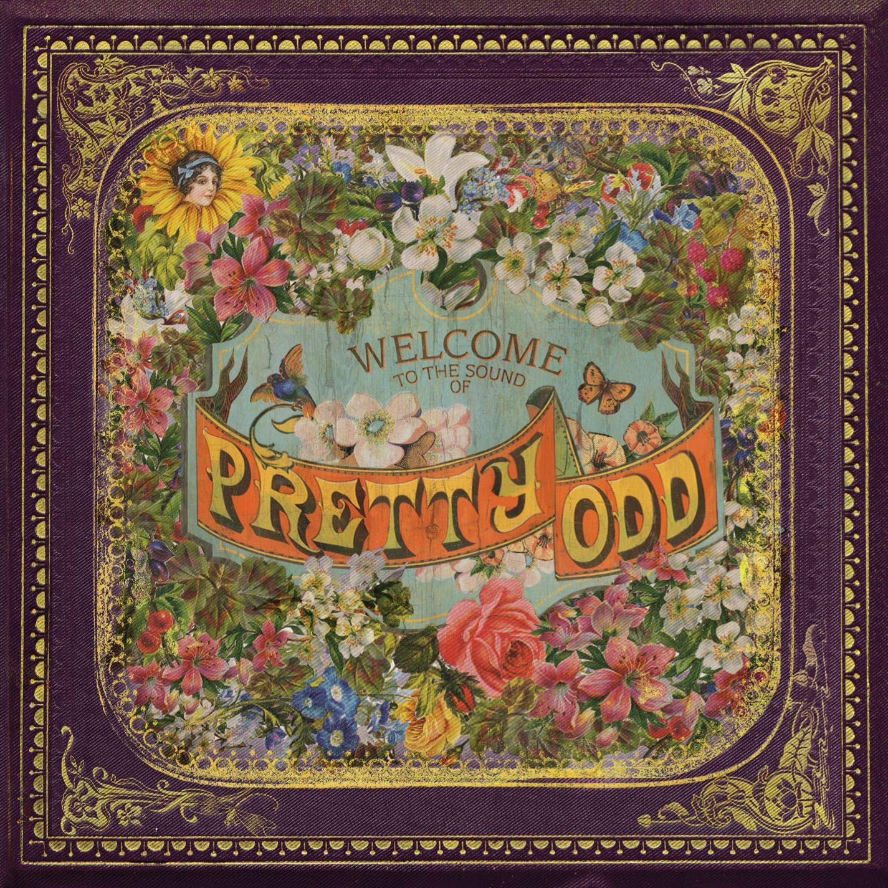
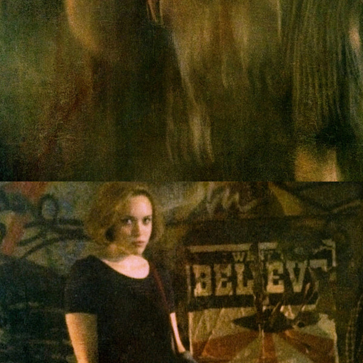
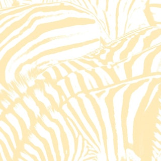
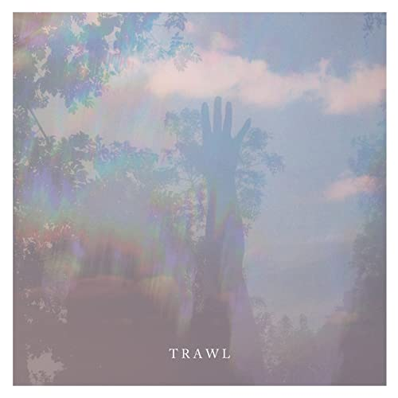

<!DOCTYPE html>
<html lang="en">
<head>
  <meta charset="UTF-8">
  <meta name="viewport" content="width=device-width, initial-scale=1.0">
  <title> Absolute Best Album's Gallery</title>
  <link rel="stylesheet" type="text/css" href="style.css">
  <link href="https://fonts.googleapis.com/css?family=Monoton&display=swap" rel="stylesheet">
  <link href="https://fonts.googleapis.com/css?family=Merienda&display=swap" rel="stylesheet">
</head>
<body>
  <h1> Favorite Album Gallery </h1>

  
 Welcome to my music gallery. As a music fanatic, I found it neccesary to put you on to some amazing masterpieces of music.

  
 Enjoy.

  

  
  
  
  
  
  
  
  
  
  
  
  <a href="https://music.apple.com/us/album/trawl-ep/572240693"> 

</body>

</html>